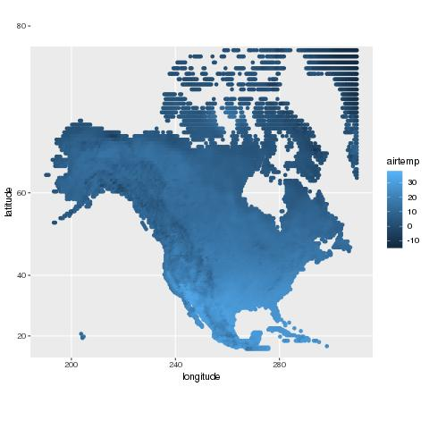
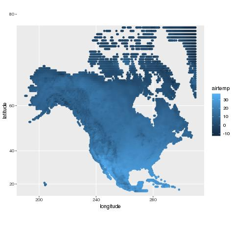
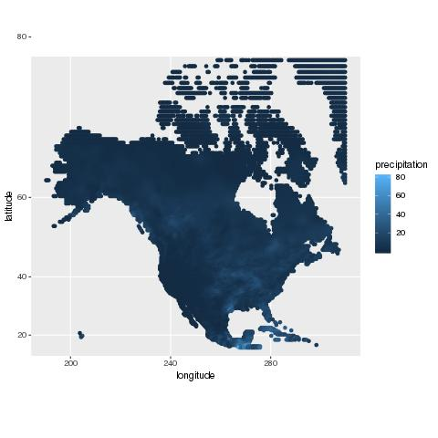

### Data

Data from [NOAA data](https://www.esrl.noaa.gov/psd/data/gridded/data.UDel_AirT_Precip.html was used in-order to observe a relationship between
Precipitation and Air Temperature from June of 1960, 1986, and 2014 as they change over time. 

### Temperature

The Air Temperature in North America appears to increase from 1960 to 1986, then decrease from 1986 to 2014, although the changes appear to be moderate.

### Precipitation

The participation in North America appears to go down as time passes. The participation also seems to be higher throughout a diagonal in the continent, from Florida to Alaska, in 1960, then seems to be higher away from the sliver in 1987, then revert back in 2014. 

